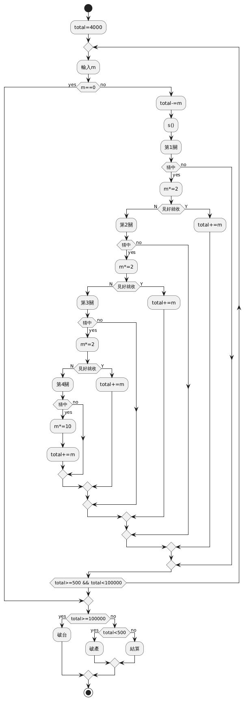
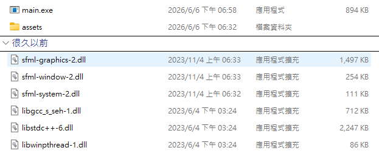
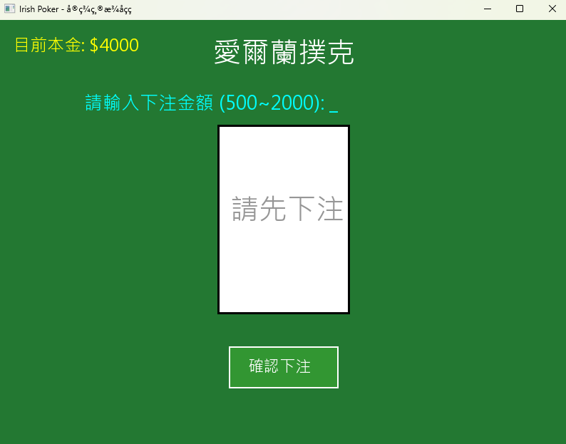

# 組別:第9組

# 系級班級:資工1A

# 成員:組長 張虔立、組員 莊承翰 謝定瑜

# 專題題目:愛爾蘭撲克

# 程式介紹:
## 使用者可以先輸入下注金額來開局，並在四個關卡中輸入對應數字來猜牌，猜中時還能輸入 Y 或 N 來決定是否見好就收。程式會判斷下注金額是否超出本金範圍、或指令是否輸入錯誤，如果不合法就會要求重新輸入。當玩家本金達到 10萬 恭喜破台，或是輸到低於 500 無法下注而破產時，遊戲即刻結束。

# 程式如何安裝執行
## 點擊main.exe

# 程式畫面截圖

# 分工資訊
## 張虔立 編寫程式、製作程式UI
## 莊承翰 編寫程式、製作Readme
